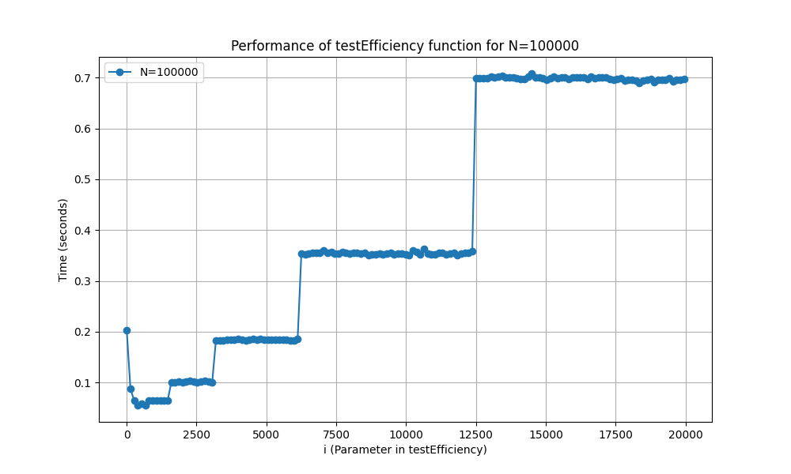
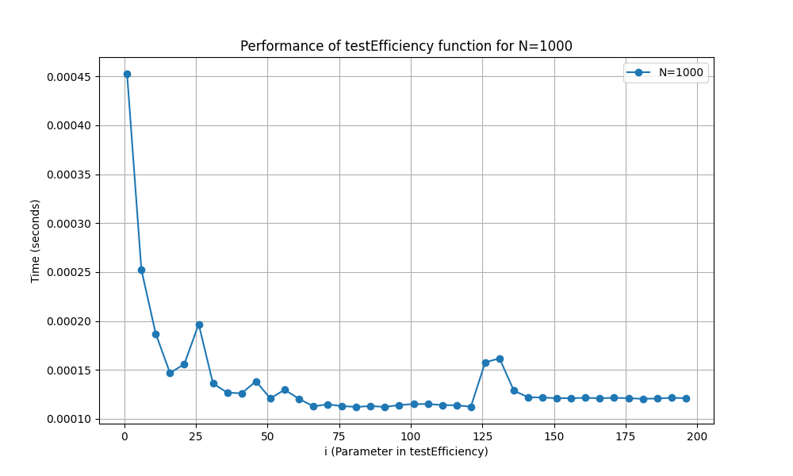

# 实验报告

## 基本内容
代码实现了基本的插入排序和归并排序，并支持了多种基本数据类型以及字符串
代码包括了一个简单的随机数生成器和一个简单的数据处理脚本
代码正确性如图


## 对混合算法时间复杂度的简要计算和分析

```cpp
template<typename T>
void SortSet::insertSort(vector<T>& vec,int begin,int end){
    int len=end-begin+1;     //1
    for(int i=begin;i<end+1;i++){ //n
        int current_value=vec[i];
        int j=i-1;                  //2
        while(j>=begin&&vec[j]>current_value){//sigma(1,n-1)*2
            vec[j+1]=vec[j];
            j--;
        }
        vec[j+1]=current_value;  //1
    }
}
```
对于插入排序的部分,可以设其f(n)=c_1n*2+c_2n+c3

```cpp

template<typename T>
void SortSet::mergeSortHelperMixed(vector<T>& vec,int begin_index,int end_index,int change_len){
    if((end_index-begin_index+1)<=change_len){
        insertSort(vec,begin_index,end_index);
    }else{
        int mid_index=(begin_index+end_index)/2;
        mergeSortHelperMixed(vec,begin_index,mid_index,change_len);
        mergeSortHelperMixed(vec,mid_index+1,end_index,change_len);
        mergeVector(vec, begin_index, mid_index+1, end_index);
    }
   
}

template<typename T>
void SortSet::mergeVector(vector<T>& vec,int left_start,int right_start,int end_index){
    vector<T> left_arr;
    vector<T> right_arr;

    for(int i=left_start;i<right_start;i++){
        left_arr.push_back(vec[i]);
    }

    for(int i=right_start;i<=end_index;i++){
        right_arr.push_back(vec[i]);
    }

    int i=0,j=0;
    int target_index=left_start;
    while(i<left_arr.size()&&j<right_arr.size()){
        if(left_arr[i]<=right_arr[j]){
            vec[target_index]=left_arr[i];
            i++;
        }else{
            vec[target_index]=right_arr[j];
            j++;
        }
        target_index++;
    }

    while(i<left_arr.size()){
        vec[target_index]=left_arr[i];
        i++;
        target_index++;
    }

    while(j<right_arr.size()){
        vec[target_index]=right_arr[j];
        j++;
        target_index++;
    }
}
```

对于归并排序部分，设为c_4nlgn+c_5n+c_6

混合排序的时候，前半部分有：
T(n)=2T(n/2)+cn,n>k
T(n)=c_1n^2+c_2n+c_3,0<n<=k
在这里计算决策树的高度：[lgn-lgk]=h
因此前半部分为：cn*(lgn-lgk)
后半部分为(c_1k^2+c_2k+c_3)*(n/k)
相当于将n=k之下的部分降低到了O(kn)的复杂度（但系数会相对变大）
当n变大时，对应的k也会变大
如果k取太大，其相对与n就无法忽略，相当于复杂度回到了n^2数量级
将两部分合起来，为cnlg(n/k)+c_5kn
因此总体复杂度的上界满足 O(log(n/k))+O(kn)
对比cnlgn,相减得到:cnlgk-c_5kn
或求导，f=c_1*log(n/k)+c_2*nk
对k求导，得到c_2n-c1ln2/k=0
c_2n=c_1ln2/k
k=c_1ln2/c_2n
因为归并排序在深度递归时开销很大，即c较大，而当k较小时，插入排序的性能较好，即c_5较小，所以当k较小时，
这种混合算法能够在实际应用中提高排序效率。
对于现代计算机，因为插入排序在空间的局部性较好（比如对缓存的利用更好），所以在n为三位数时依旧对归并排序有较好的性能。
在实际应用中，如果真的需要管理数十万的数据，更多会采用数据库等方式。

## 通过实际测试分析得到的规律：

通过大规模测试和数据分析，可以发现，混合排序的运行速度与n和k都有关。
n一定时，k对时间的影响呈现阶梯状。当k从0变大时，运行速度会先出现一个大幅度的增加，随后保持稳定。
继续增大k，运行速度会在达到一系列阈值时突然降低,总体运行时间呈现阶梯状,每级阶梯大约是前一级别的两倍高。（这里的进一步分析超过了我得数学水平，因此只能大概的说明）
在我的测试中，k的最好值大约在50-400之间取到，与n的大小有关。n越大，k的最好值也相对越大，但一般不会超过500.
* 当n较小时，该规律不明显，n较大时明显
* 以下是测试的统计数据。横坐标为零界点取值，纵坐标为时间。







