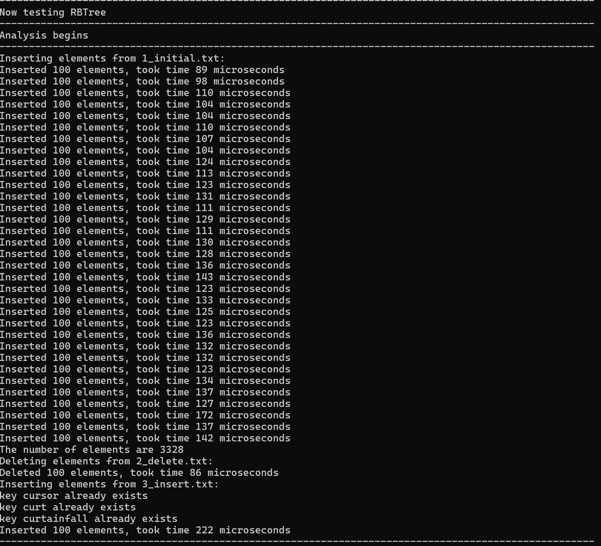
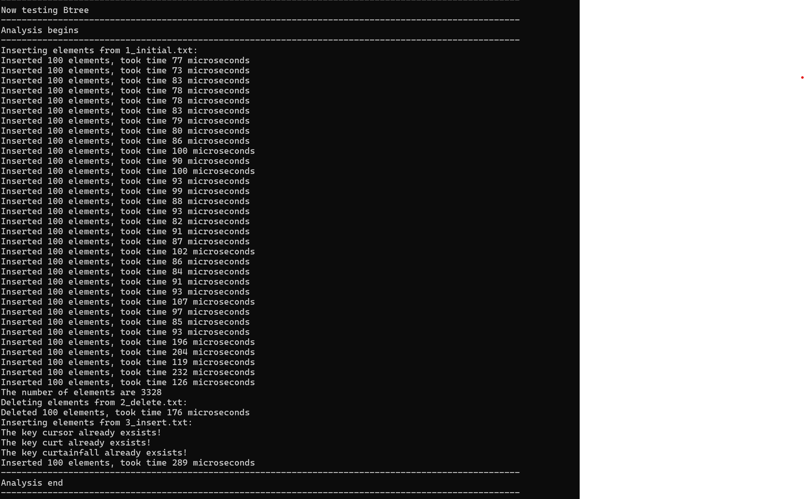

# 23302010034 Project_1 说明文档

## 1 实现的内容

实现了经典的红黑树和 b 树，并在此基础上封装了两种对应的 map，并基于 map 设计了要求的
简单字典系统。

## 2 性能测试

## 3 个数据集的测试结果(1000 数量级)

### RB 树



### B 树



### 分析

图中发现，在给定测试集上，rb 树的第一次插入表现反而不如 b 树
原因可能是因为给定数据完全按照顺序排列，导致红黑树反而没有那么平衡且需要频繁调整(即左侧几乎没有红色节点)，而 b 树反而更适应这种数据集。
rb 树的删除表现体现了他的优势，因为删除并不是按顺序来的，可以看到删除快了近一倍
rb 树的第二次插入同样体现了其优势，因为此时数据也没有那么好的顺序。

### 总结

rb 树的对于完全按顺序排列的数据表现确实不如 b 树，但对更一般的情况以及删除都有优势

## 大批量测试结果（对于 10^9 数量级，能够完全占据内存

### RBTree

## Current Index :125000000

#### 20 次随机 search 消耗时间

Search took time 4356 micro seconds  
Search took time 522 micro seconds  
Search took time 2842 micro seconds  
Search took time 2468 micro seconds  
Search took time 6317 micro seconds  
Search took time 1417 micro seconds  
Search took time 428 micro seconds  
Search took time 485 micro seconds  
Search took time 572 micro seconds  
Search took time 314 micro seconds  
Search took time 925 micro seconds  
Search took time 255 micro seconds  
Search took time 815 micro seconds  
Search took time 1802 micro seconds  
Search took time 432 micro seconds  
Search took time 281 micro seconds  
Search took time 11 micro seconds  
Search took time 6 micro seconds  
Search took time 6 micro seconds  
Search took time 6 micro seconds  

---

#### 20 次随机 Index 的 insert 消耗时间

Insert took time 918 micro seconds  
Insert took time 15 micro seconds  
Insert took time 4 micro seconds  
Insert took time 4 micro seconds  
Insert took time 3 micro seconds  
Insert took time 4 micro seconds    
Insert took time 5 micro seconds  
Insert took time 9 micro seconds  
Insert took time 6 micro seconds  
Insert took time 5 micro seconds  
Insert took time 7 micro seconds  
Insert took time 5 micro seconds  
Insert took time 8 micro seconds  
Insert took time 5 micro seconds  
Insert took time 4 micro seconds  
Insert took time 5 micro seconds  
Insert took time 4 micro seconds  
Insert took time 5 micro seconds  
Insert took time 5 micro seconds  
Insert took time 5 micro seconds  
Insert took time 4 micro seconds  
  
---

### BTree

## Current Index :95000000

#### 20 次随机 search 消耗时间

Search took time 4027 micro seconds  
Search took time 841 micro seconds  
Search took time 4242 micro seconds  
Search took time 6569 micro seconds  
Search took time 3961 micro seconds  
Search took time 4957 micro seconds  
Search took time 774 micro seconds  
Search took time 238 micro seconds  
Search took time 1435 micro seconds  
Search took time 671 micro seconds  
Search took time 91 micro seconds  
Search took time 340 micro seconds  
Search took time 988 micro seconds  
Search took time 365 micro seconds  
Search took time 253 micro seconds  
Search took time 258 micro seconds  
Search took time 73 micro seconds  
Search took time 17 micro seconds  
Search took time 8 micro seconds  
Search took time 7 micro seconds  

---

#### 20 次随机 insert 消耗时间

Insert took time 377 micro seconds  
Insert took time 13 micro seconds  
Insert took time 6 micro seconds  
Insert took time 5 micro seconds  
Insert took time 4 micro seconds   
Insert took time 4 micro seconds  
Insert took time 9 micro seconds  
Insert took time 8 micro seconds  
Insert took time 8 micro seconds  
Insert took time 6 micro seconds  
Insert took time 6 micro seconds  
Insert took time 6 micro seconds  
Insert took time 5 micro seconds  
Insert took time 4 micro seconds  
Insert took time 7 micro seconds  
Insert took time 5 micro seconds  
Insert took time 7 micro seconds  
Insert took time 5 micro seconds  
Insert took time 5 micro seconds  
Insert took time 6 micro seconds  
Insert took time 5 micro seconds  

### 分析

当数量级非常大以至于超过物理内存时，search 呈现了不稳定性。
但总体来说，红黑树的耗时方差和均值都大于 b 树，且随着数据集进一步增大，差距会更明显
对于 insert，相对而言耗时没有那么大，但是 b 树依旧呈现了上述的优势
可见，在内存不够的情况下，b 树相对红黑树相对有优势

## 3 重要的操作实现

### RB 树

#### Insert

```cpp
 while (node->getParent() != nullptr && node->getParent()->getColor() == REDNODE) {
    if (node->getGrandParent() != nullptr && node->getParent()->isLeftChild()) { // 父节点是祖父的左子节点
        y = node->getUncleAunt  ();                                                // 叔叔节点

        if (y != NULLNode && y->getColor() == REDNODE) { // Case 1: 叔叔是红色
            node->getParent()->setColor(BLACKNODE);
            y->setColor(BLACKNODE);
            node->getGrandParent()->setColor(REDNODE);
            node = node->getGrandParent(); // 向上修复
        } else {
            if (node->isRightChild()) { // Case 2: 节点是右子节点
                node = node->getParent();
                leftRotate(node); // 预旋转
            }

            // Case 3: 节点是左子节点
            node->getParent()->setColor(BLACKNODE);
            node->getGrandParent()->setColor(REDNODE);
            rightRotate(node->getGrandParent());
            break;
        }
    }
 }
```

对应了ppt上的三种fix，对称情况略

#### Delete
```cpp
template <typename KeyType, typename DataType>
void RedBlackTree<KeyType, DataType>::deleteNode(const KeyType &key) {
    TreeNode *deleteTarget = search(key);
    if (!deleteTarget || deleteTarget->isNULLNode()) {
        return; // 空节点不进行删除操作
    }

    TreeNode *replaceNode;
    TreeNode *fixNode;
    RBTreeColor originalColor = deleteTarget->getColor(); // 保存删除节点的颜色
    if (!deleteTarget->hasLeft() && !deleteTarget->hasRight()) {
        replaceNode = deleteTarget->getRight();
        replaceNode->setParent(deleteTarget->getParent()); // 删除叶节点，需要额外暂时设置NULLnode的父亲方便得到兄弟进行fix
        transplant(deleteTarget, deleteTarget->getRight());
    } else if (!deleteTarget->hasLeft()) {
        // 目标节点没有左子节点，用右子节点代替
        replaceNode = deleteTarget->getRight();
        transplant(deleteTarget, deleteTarget->getRight());
    } else if (!deleteTarget->hasRight()) {
        // 目标节点没有右子节点，用左子节点代替
        replaceNode = deleteTarget->getLeft();
        transplant(deleteTarget, deleteTarget->getLeft());
    } else {
        // 目标节点有两个子节点，找到其后继节点
        TreeNode *successor = minimum(deleteTarget->getRight());
        originalColor = successor->getColor();
        replaceNode = successor->getRight();

        if (replaceNode->isNULLNode()) { // replaceNode为NULLNode，也需要额外暂时设置NULLnode的父亲方便得到兄弟节点进行fix
            replaceNode->setParent(successor->getParent());
        }

        if (successor->getParent() == deleteTarget) {
            replaceNode->setParent(successor);
        } else {
            transplant(successor, successor->getRight());
            successor->setRight(deleteTarget->getRight());
        }

        transplant(deleteTarget, successor);
        successor->setLeft(deleteTarget->getLeft());
        successor->getLeft()->setParent(successor);
        successor->setColor(deleteTarget->getColor());
    }
    if (replaceNode->isNULLNode()) {
        this->updateSubtreeSize(replaceNode->getParent());
    } else {
        this->updateSubtreeSize(replaceNode);
    }

    if (originalColor == BLACKNODE) {
        deleteFix(replaceNode);
    }
    delete deleteTarget;
}

template <typename KeyType, typename DataType>
void RedBlackTree<KeyType, DataType>::deleteFix(TreeNode *node) {

    while (node != root && node->isBlack()) {
        if (node->isLeftChild()) {
            TreeNode *sibling = node->getSibling();
            if (sibling->isRed()) { // case 1 左旋转化为其他case
                sibling->setColor(BLACKNODE);
                node->getParent()->setColor(REDNODE);
                leftRotate(node->getParent());
                sibling = node->getParent()->getRight();
            }

            if (sibling->getLeft()->isBlack() && sibling->getRight()->isBlack()) {
                sibling->setColor(REDNODE); // case 2  sibling以及他的儿子全黑，变色，向上继续判断
                node = node->getParent();
            } else {
                if (sibling->getRight()->isBlack()) { // case 3 sibling黑，右黑左红右旋转化为case 4
                    sibling->getLeft()->setColor(BLACKNODE);
                    sibling->setColor(REDNODE);
                    rightRotate(sibling);
                    sibling = node->getParent()->getRight();
                }
                sibling->setColor(node->getParent()->getColor()); // case 4 左旋 完成调整
                node->getParent()->setColor(BLACKNODE);
                sibling->getRight()->setColor(BLACKNODE);
                leftRotate(node->getParent());
                node = root;
            }
        } else { // 对称情况
            TreeNode *sibling = node->getSibling();
            if (sibling->isRed()) {
                sibling->setColor(BLACKNODE);
                node->getParent()->setColor(REDNODE);
                rightRotate(node->getParent());
                sibling = node->getParent()->getLeft();
            }

            if (sibling->getLeft()->isBlack() && sibling->getRight()->isBlack()) {
                sibling->setColor(REDNODE);
                node = node->getParent();
            } else {
                if (sibling->getLeft()->isBlack()) {
                    sibling->getRight()->setColor(BLACKNODE);
                    sibling->setColor(REDNODE);
                    leftRotate(sibling);
                    sibling = node->getParent()->getLeft();
                }
                sibling->setColor(node->getParent()->getColor());
                node->getParent()->setColor(BLACKNODE);
                sibling->getLeft()->setColor(BLACKNODE);
                rightRotate(node->getParent());
                node = root;
            }
        }
    }
    node->setColor(BLACKNODE);
    NULLNode->setColor(BLACKNODE); // 重新初始化NULLnode
    NULLNode->setParent(nullptr);
}
```

delete同样遵守ppt上四种情况以及对称，同时，需要注意到delete在处理删除叶节点时，暂时设置哨兵节点的parent来保证他能够正确找到sibling以套用通用的fix代码

### B 树

#### Insert
```cpp
template <typename KeyType, typename ValueType>
void BTree<KeyType, ValueType>::insert(const KeyType key, const ValueType &value) {
    TreeNode *nodeExist = search(key);
    if (nodeExist != nullptr) {
        cout << "The key " << key << " already exsists!" << endl;
        for (int i = 0; i < nodeExist->getKeyNums(); i++) {
            if (compareTo(nodeExist->getKeyAt(i), key) == 0) {
                nodeExist->setValueAt(i, value);
            }
        }
        return;
    }

    if (root == nullptr) {
        root = createNode(true);
        root->insertKeyValueAt(0, key, value);
        return;
    } else {
        bool isRootFull = root->isFull();
        if (isRootFull) { // case 1
            TreeNode *newRoot = createNode(false);
            newRoot->insertChildAt(0, root);

            splitChild(newRoot, 0, root); // newRoot是新root，且原来的root左，令创建一个节点右
            int i = 0;
            if (newRoot->getKeyAt(0) < key) {
                i++;
            }
            insertNotFull(newRoot->getChildAt(i), key, value);

            root = newRoot;
        } else {
            // case 2 如果根节点未满，直接插入
            insertNotFull(root, key, value);
        }
    }
}

template <typename KeyType, typename ValueType>
void BTree<KeyType, ValueType>::insertNotFull(TreeNode *node, const KeyType key, const ValueType &value) {

    int i = node->getKeyNums() - 1;

    if (node->isLeaf()) {
        while (i >= 0 && key < node->getKeyAt(i)) {
            i--;
        }
        node->insertKeyValueAt(i + 1, key, value); // 叶节点直接插入

    } else {
        // 如果是非叶节点，找到合适的子节点
        while (i >= 0 && compareTo(key, node->getKeyAt(i)) < 0) {
            i--;
        }
        i++;

        // 如果子节点满了，先分裂再插入
        if (node->getChildAt(i)->isFull()) {
            splitChild(node, i, node->getChildAt(i));

            if (key > node->getKeyAt(i)) {
                i++;
            }
        }

        insertNotFull(node->getChildAt(i), key, value); 
    }
    node->updateSizes(); 
}
```

只需要注意insert时要预先考虑分裂即可
#### Delete
```cpp
template <typename KeyType, typename ValueType>
void BTree<KeyType, ValueType>::removeHelper(TreeNode *node, KeyType key) {
    int index = 0;
    while (index < node->getKeyNums() && compareTo(node->getKeyAt(index), key) < 0) {
        index++;
    }

    // case 1 找到了对应的节点
    if (index < node->getKeyNums() && compareTo(node->getKeyAt(index), key) == 0) {
        if (node->isLeaf()) {
            // 如果是叶节点，直接删除
            node->removeKeyValueAt(index);

        } else {
            // 进一步处理
            deleteFromNonLeaf(node, index);
        }
    } else {
        if (node->isLeaf()) {
            // 这个情况下节点不存在
            return;

        } else {
            // 当key大于所有的储存的key时，有可能会出现越界
            bool flag = (index == node->getKeyNums());

            // 子节点不够删，那么就先把他补充到可以删的大小
            // 如果index指向最右的儿子且fix的时候发生了合并，合并函数会合并[-2:-1]的节点
            // 因此需要特殊考虑防止越界
            if (node->getChildAt(index)->getKeyNums() < T) {
                fixUnderFlow(node, index);
            }

            // 可能会发生合并，这个时候，child会减少，因而当index本来是最后一个的时候，需要访问前一个儿子防止越界
            if (flag && index > node->getKeyNums()) {
                removeHelper(node->getChildAt(index - 1), key);
            } else {
                removeHelper(node->getChildAt(index), key);
            }
        }
    }
    node->updateSizes();
}

template <typename KeyType, typename ValueType>
void BTree<KeyType, ValueType>::deleteFromNonLeaf(TreeNode *node, int index) {
    KeyType key = node->getKeyAt(index);

    // case 1 左子树够大，找前驱节点替换待删除节点，再删除前驱节点
    if (node->getChildAt(index)->getKeyNums() >= T) {
        std::pair<KeyType, ValueType> pred = getPredecessor(node->getChildAt(index));
        node->setKeyValueAt(index, pred.first, pred.second);
        removeHelper(node->getChildAt(index), pred.first);
    }
    // case 2 右子树足够大，找后继节点
    else if (node->getChildAt(index + 1)->getKeyNums() >= T) {
        std::pair<KeyType, ValueType> succ = getSuccessor(node->getChildAt(index + 1));
        node->setKeyValueAt(index, succ.first, succ.second);
        removeHelper(node->getChildAt(index + 1), succ.first);
    }
    // case 3 合并节点
    else {
        mergeNodes(node, index);
        removeHelper(node->getChildAt(index), key);
    }
}

```

其中，fixUnderFlow会优先考虑借键值对，如果还是不能解决问题，则直接merge两个node

### 综合
两个树节点都维护了一个子树大小以方便根据Index查找对应的节点，从而更好的适配字典功能


## 4 演示 见演示课，略

## 5 总结
本次pj工作量比较大，红黑树和b树都是复杂数据结构，且每种情况都需要较多的debug来保证细节正确无误。总体而言，还是比较有挑战意义和锻炼价值的。