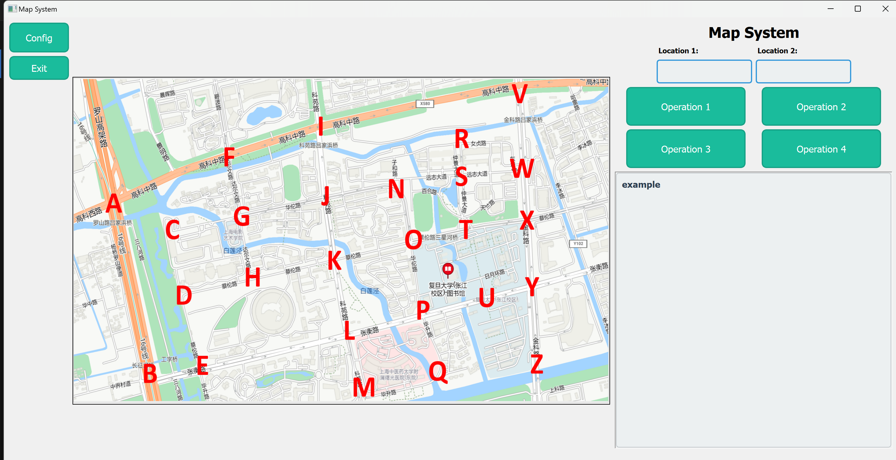
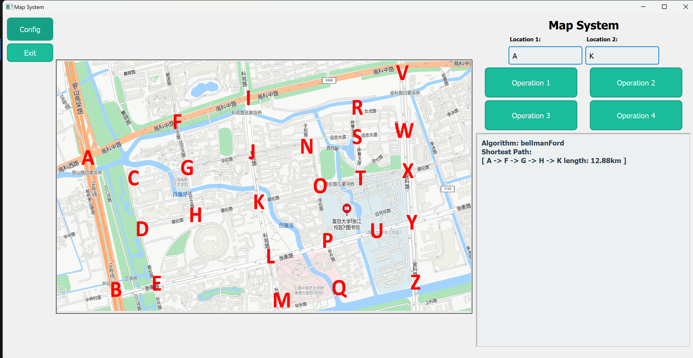
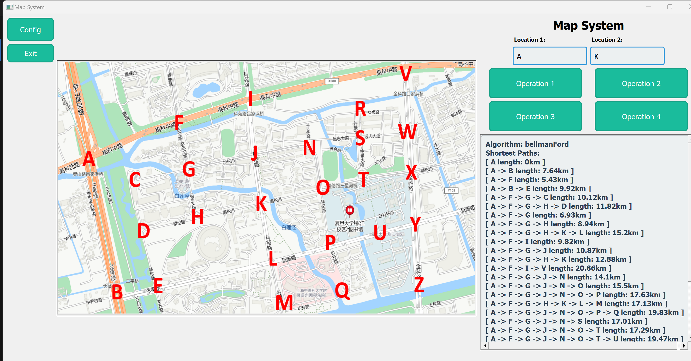
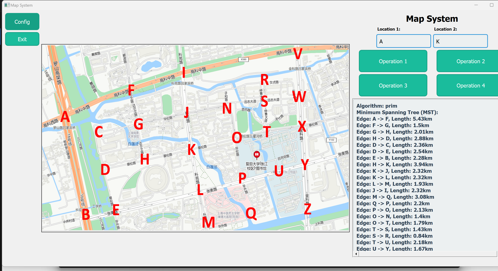
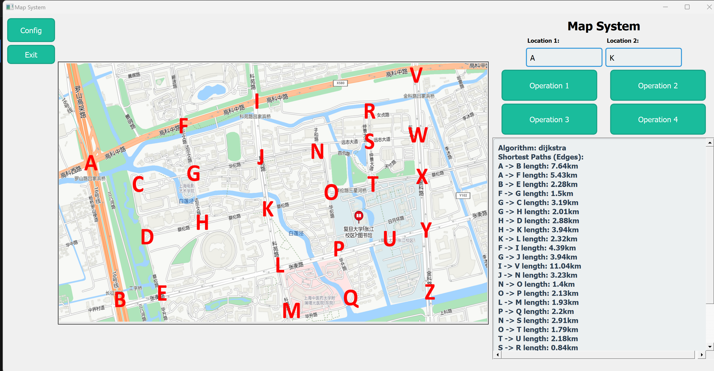
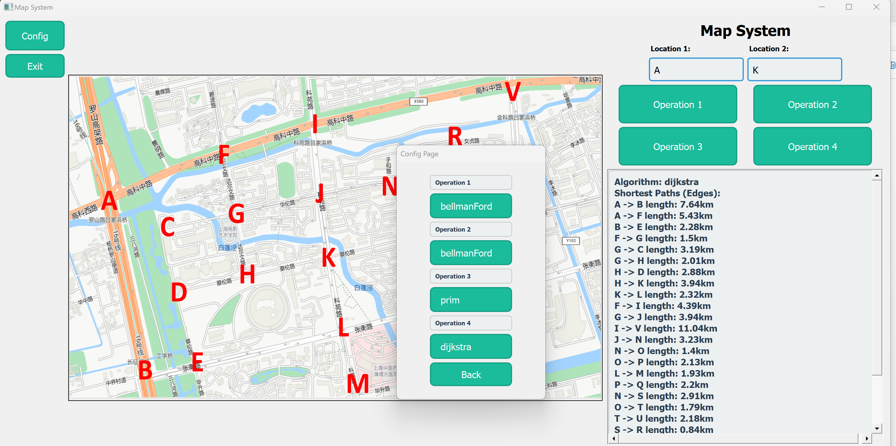

# 23302010034 傅子澈 PJ2实验报告

## 实验内容

使用c++实现了一个带有简易GUI的地图系统，支持了文档要求的4种Operation type

### 1.核心算法实现

#### 图的表示方法

本pj继续使用上一次lab实现的图类进行开发，使用邻接表作为图的存储方式。不做过多赘述

#### 图算法实现

本pj实现了4个图算法，dijkstra、bellmanFord、prim和kruskal。四个算法种，除了prim以外都进行了扩展以支持找到所有可能解

##### dijkstra

```cpp
vector<vector<int>> dijkstra(int sourceId) {
        std::string key = "dijkstra";
        if (auto cachedResult = getCachedResult<std::vector<std::vector<int>>>(key, sourceId)) {
            return *cachedResult;
        }
        vector<double> distances(graph.getVertices().size(), INT_MAX);
        distances[sourceId] = 0;

        std::unordered_map<int, vector<int>> prev;
        for (int i = 0; i < graph.getVertices().size(); i++) {
            prev[i] = {};
        }

        std::priority_queue<distAndId, vector<distAndId>, std::greater<>> pq;
        pq.push({0, sourceId});

        auto adjList = graph.getAdjList();

        while (!pq.empty()) {
            auto [dist, u] = pq.top();
            pq.pop();

            if (dist > distances[u]) {
                continue;
            }

            for (const auto &edge : adjList[u]) {
                double newDist = distances[u] + edge.get()->getWeight();

                int v = edge.get()->getSecond()->getId();

                if (newDist < distances[v]) {
                    distances[v] = newDist;
                    prev[v] = {u};
                    pq.push({newDist, v});
                } else if (std::abs(newDist - distances[v]) < 1e-6) {

                    if (std::find(prev[v].begin(), prev[v].end(), u) == prev[v].end()) {
                        prev[v].push_back(u);
                    }
                }
            }
        }

        vector<vector<int>> allPaths;
        vector<int> path;

        std::function<void(int)> backtrack = [&](int node) {
            if (node == sourceId) {
                path.push_back(node);
                allPaths.push_back(vector<int>(path.rbegin(), path.rend())); // 反转存储路径
                path.pop_back();
                return;
            }
            path.push_back(node);
            for (int p : prev[node]) {
                backtrack(p);
            }
            path.pop_back();
        };

        for (int targetId = 0; targetId < graph.getVertices().size(); ++targetId) {
            if (distances[targetId] != INT_MAX) {
                backtrack(targetId);
            }
        }
        storeInCache(key, sourceId, allPaths);
        return allPaths;
    }
```

实现如上，以下是简要的解释：
这里首先有经典的dijkstra实现，即构建优先队列后逐渐将目前distance最小的顶点拿出，并更新他的所有邻接的点的举例，即min(dist[v],dist[u]+w(u,v))

时间复杂度O((V + E) log V)
因为V通常<< E,可认为O(ElogV)
logV来自于优先队列操作


回溯路径时，对每个节点都进行backtrack操作，取出其所有的前驱节点各自来构建路径，直到回溯到了sourceId对应的节点
    
为了实现找到所有可能的解，需要进行拓展
在这里，我们处理时，如果min(dist[v],dist[u]+w(u,v))种两个值相等，就同时记录两种情况，即prev[v]种增加了u。这意味着，一个节点可能有多个前驱节点，即增加的u以及原来的前驱。这使得在回溯时，可以从两条相同的长度的路径达到u。（如果后来又有更短路径，那么所有的前驱都会被替换）

##### bellmanFord

```cpp
vector<vector<int>> bellmanFord(int sourceId) {
        std::string key = "bellmanFord";
        if (auto cachedResult = getCachedResult<std::vector<std::vector<int>>>(key, sourceId)) {
            return *cachedResult;
        }
        int n = graph.getVertices().size();
        vector<double> distances(n, INT_MAX);
        distances[sourceId] = 0;


        std::unordered_map<int, vector<int>> prev;
        for (int i = 0; i < n; ++i) {
            prev[i] = {};
        }

        vector<std::shared_ptr<Edge<DataType>>> edges = graph.getEdges(); // 获取图中所有边
        bool updated;
        for (int i = 1; i < n; i++) {
            updated = false;
            for (const std::shared_ptr<Edge<DataType>> &edge_ptr : edges) {
                Edge<DataType> edge = (*edge_ptr.get());
                int u = edge.getFirst().get()->getId();
                int v = edge.getSecond().get()->getId();
                double weight = edge.getWeight();
                if (distances[u] + weight < distances[v]) {
                    distances[v] = distances[u] + weight;
                    prev[v] = {u};
                    updated = true;
                } else if (std::abs(distances[u] + weight - distances[v]) < 1e-6) {

                    if (std::find(prev[v].begin(), prev[v].end(), u) == prev[v].end()) {
                        prev[v].push_back(u);
                    }
                }
            }
            if (!updated) {
                break;
            }
        }
        vector<vector<int>> allPaths;
        vector<int> path;

        std::function<void(int)> backtrack = [&](int node) {
            if (node == sourceId) {
                path.push_back(node);
                allPaths.push_back(vector<int>(path.rbegin(), path.rend())); // 反转存储路径
                path.pop_back();
                return;
            }
            path.push_back(node);
            for (int p : prev[node]) {
                backtrack(p);
            }
            path.pop_back();
        };

        for (int targetId = 0; targetId < graph.getVertices().size(); ++targetId) {
            if (distances[targetId] != INT_MAX) {
                backtrack(targetId);
            }
        }
        storeInCache(key, sourceId, allPaths);
        return allPaths;
    }
```

这里同样有经典的bf算法，我们对所有边进行n-1次操作，同样取min(dist[u],dist[v]+w(u,v)),我们对边进行至多n-1次操作。n-1来自于最短路径至多可以经过n-1条边，因此我们要考虑n-1次才能将所有顶点纳入考虑。如果其中迭代在某一轮没有任何更新，则提前终止循环。
时间复杂度O(V*E)因为有两层循环
回溯和多解的方法与前一种基本一样，不在这里过多赘述

##### prim

```prim
 std::vector<std::shared_ptr<Edge<DataType>>> prim(int startId) {
        string key = "prim";
        if (auto cachedResult = getCachedResult<vector<shared_ptr<Edge<DataType>>>>(key, startId)) {
            return *cachedResult;
        }

        int n = graph.getVertices().size();
        vector<bool> InMST(n, false);
        std::priority_queue<shared_ptr<Edge<DataType>>, vector<shared_ptr<Edge<DataType>>>, std::function<bool(const shared_ptr<Edge<DataType>> &, const shared_ptr<Edge<DataType>> &)>> pq([](const shared_ptr<Edge<DataType>> &a, const shared_ptr<Edge<DataType>> &b) {
            return a->getWeight() > b->getWeight(); 序
        });
        vector<shared_ptr<Edge<DataType>>> mstEdges; 
        InMST[startId] = true;
        auto adjList = graph.getAdjList();
        for (const auto &edge_ptr : adjList[startId]) {
            pq.push(edge_ptr);
        }
        while (!pq.empty()) {
            auto edge_ptr = pq.top();
            pq.pop();

            Edge<DataType> *edge = edge_ptr.get();
            int dest = edge->getSecond()->getId(); 

            if (InMST[dest]) continue;

            mstEdges.push_back(edge_ptr);

            InMST[dest] = true;

            for (const auto &edge : adjList[dest]) {
                int next = edge.get()->getSecond()->getId();
                if (!InMST[next]) {
                    pq.push(edge);
                }
            }
        }
        storeInCache(key, startId, mstEdges);
        return mstEdges;
    }
```

prim算法每次从优先队列取出权重最小的边，检查其终点是否在MST种，不在就加入。这里没有实现多解性
复杂度O(ElogV),logV来自于优先队列操作

##### kruskal

```cpp
std::vector<std::vector<std::shared_ptr<Edge<DataType>>>> kruskal() {
        string key = "kruskal";
        if (auto cachedResult = getCachedResult<vector<std::vector<std::shared_ptr<Edge<DataType>>>>>(key, 0)) {
            return *cachedResult;
        }
        int n = graph.getVertices().size();
        std::vector<std::shared_ptr<Edge<DataType>>> edges = graph.getEdges();
        std::vector<std::vector<std::shared_ptr<Edge<DataType>>>> results;

        std::set<std::set<std::pair<int, int>>> uniqueMSTs; 

        std::sort(edges.begin(), edges.end(), [](const std::shared_ptr<Edge<DataType>> &a, const std::shared_ptr<Edge<DataType>> &b) { return a->getWeight() < b->getWeight(); });

        
        double minTotalWeight = calculateMinimumTotalWeight(edges, n);

      
        std::function<void(int, std::vector<std::shared_ptr<Edge<DataType>>>, std::vector<int>, std::vector<int>, double)> backtrack;
        backtrack = [&](int edgeIndex, std::vector<std::shared_ptr<Edge<DataType>>> currentMST, std::vector<int> parent, std::vector<int> rank, double currentWeight) {
           
            if(results.size()>=2){
                return;
            }

            
            if (currentMST.size() == n - 1) {
               
                if (std::abs(currentWeight - minTotalWeight) < 1e-6) {
                    std::set<std::pair<int, int>> edgeSet;
                    for (const auto &edge : currentMST) {
                        int u = edge->getFirst()->getId();
                        int v = edge->getSecond()->getId();
                        if (u > v) std::swap(u, v);
                        edgeSet.insert({u, v});
                    }
                    if (uniqueMSTs.find(edgeSet) == uniqueMSTs.end()) {
                        uniqueMSTs.insert(edgeSet);
                        results.push_back(currentMST);
                    }
                }
                return;
            }

            
            if (edgeIndex >= edges.size() || currentMST.size() + (edges.size() - edgeIndex) < n - 1 || currentWeight > minTotalWeight) {
                return;
            }

            for (int i = edgeIndex; i < edges.size(); ++i) {
                const auto &currentEdge = edges[i];
                int u = currentEdge->getFirst()->getId();
                int v = currentEdge->getSecond()->getId();
                double weight = currentEdge->getWeight();

               
                auto find = [&](int x, std::vector<int> &parentRef) -> int {
                    while (x != parentRef[x]) {
                        parentRef[x] = parentRef[parentRef[x]]; 
                        x = parentRef[x];
                    }
                    return x;
                };

                int rootU = find(u, parent);
                int rootV = find(v, parent);

                if (rootU != rootV) {
                    
                    std::vector<std::shared_ptr<Edge<DataType>>> newMST = currentMST;
                    newMST.push_back(currentEdge);
                    double newWeight = currentWeight + weight;

                   
                    std::vector<int> newParent = parent;
                    std::vector<int> newRank = rank;

                  
                    if (newRank[rootU] < newRank[rootV]) {
                        newParent[rootU] = rootV;
                    } else if (newRank[rootU] > newRank[rootV]) {
                        newParent[rootV] = rootU;
                    } else {
                        newParent[rootV] = rootU;
                        newRank[rootU]++;
                    }

                    
                    backtrack(i + 1, newMST, newParent, newRank, newWeight);
                }
                
                if (i < edges.size() - 1 && std::abs((edges[i].get()->getWeight() - edges[i + 1].get()->getWeight() ))< 1e-6) {
                    int id_1=edges[i]->getSecond().get()->getId();
                    int id_2=edges[i+1]->getFirst().get()->getId();
                    bool flag_1=id_1!=id_2;
                    if(flag_1){
                        backtrack(i + 1, currentMST, parent, rank, currentWeight);
                    }
                    
                }
            }
        };

        
        std::vector<int> initialParent(n);
        std::vector<int> initialRank(n, 0);
        for (int i = 0; i < n; ++i) {
            initialParent[i] = i;
        }

        std::vector<std::shared_ptr<Edge<DataType>>> currentMST;
        double initialWeight = 0.0;
        backtrack(0, currentMST, initialParent, initialRank, initialWeight);
        storeInCache(key, 0, results);
        return results;
    }
```

这里为了找到多个MST，在选择以一条边的时候，同时考虑后一条边是否和其权重相同，如果是，则同时考虑包含这一边和后一边的情况
因为这种算法复杂度很高，需要手动限制寻找的次数防止程序卡住。
在这里解释经典的kruskal
将所有边加入一个排序后的集合，每次选择一个边，看他是否成环（通过将选择后的节点合并入一个集合，之后只需判断边的节点是否在同集合即可得到其是否成环）
最终可得到MST
时间复杂度O(ElogE),因为我们的优先是针对边的

#### 架构设计

因为有gui，使用了简单的MVC架构。model储存图以及算法实现和包装，View实现GUI的组件。使用了多种布局管理器和组件进行设计。对于qt的底层组件，在这里不做赘述，只给出一些运行时的示例。

#### 显示逻辑

点击按钮后，程序从输入框读取节点名称（不合法会弹出窗口）并调用之前的算法得到结果，并将结果转为字符串传回View模块，将其展示在文本框内。config种控制了View的全局配置，决定了View调用哪种算法。

#### 具体的图片示意

##### 主界面



##### operation_1



##### operation_2



##### operation_3



最小生成树总长度57.3,说明实现是正确的

##### operation_4



##### config_page



### 总体配置

使用cmake构建项目，可执行文件在./build/bin/
若要编译完整的代码，需要有Qt库

### 总结

到这了也没啥好说的

