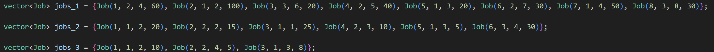
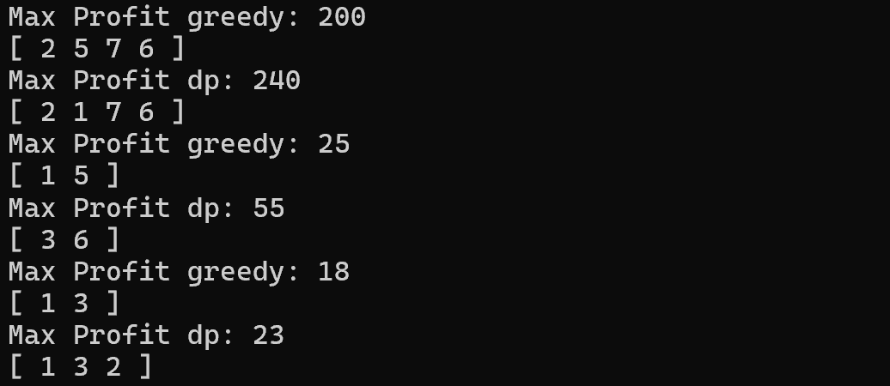
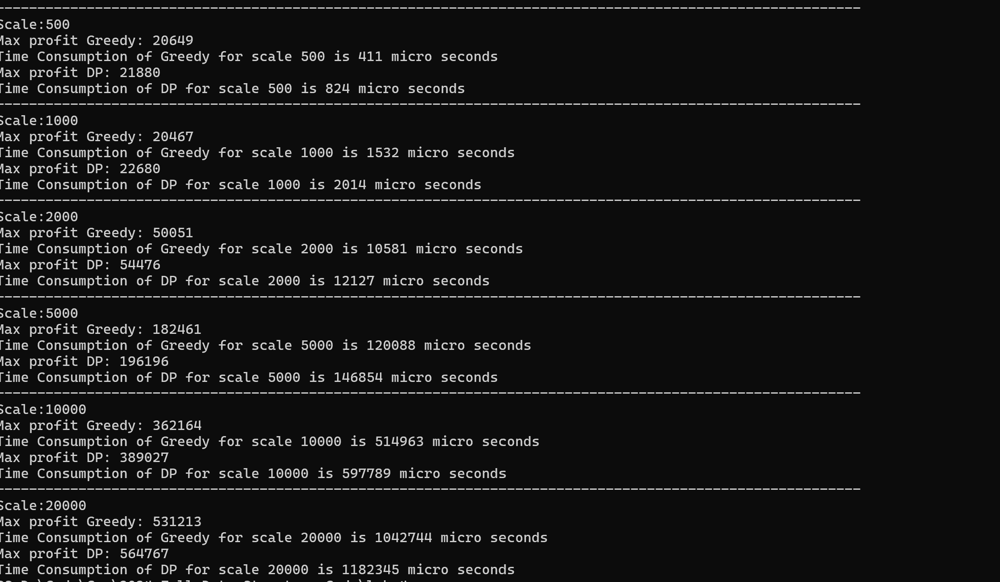

# 23302010034 傅子澈 Lab4 实验报告

## 实现内容

代码实现了使用贪心算法和动态规划解决题设问题的解，且给出了两者在不同规模的数据集下的速度和表现。

## 具体代码

### Job定义

```cpp
struct Job {
    int processingTime;
    int deadLine;
    int profit;
    Job(){}
    Job(int processingTime,int deadLine,int profit):processingTime(processingTime),deadLine(deadLine),profit(profit){}

    bool operator >(const Job& other){
        return （（float）this->profit）/this->processingTime>（（float）other->profit）/other->processingTime;
    }

    bool operator <(const Job& other){
        return （（float）this->profit）/this->processingTime<（（float）other->profit）/other->processingTime;
    }
};
```

### 贪心算法

#### 代码

```cpp
class SolutionGreedy :Solution{
private:
    vector<Job> jobs;
    int maxDeadline=INT_MIN;
public:
    SolutionGreedy(const vector<Job>& targetJobs):jobs(targetJobs){
        std::sort(jobs.begin(),jobs.end(),std::greater<>());
        for(const auto& job:jobs){
            if(job.deadLine>maxDeadline){
                maxDeadline=job.deadLine;
            }
        }
        
    }

    pair<int, vector<Job>> scheduleJob(){
        vector<bool> timeSLot;
        vector<pair<Job, int>> chosenJobs;
        timeSLot.resize(maxDeadline+2,false);
        int totalProfit=0;
        for(const auto&job:jobs){
            int ddl=job.deadLine;
            int duration=job.processingTime;
            if(duration>ddl){
                continue;
            }
             
            for(int start=ddl;start>=duration;start--){
                if (start - duration < 1) {
                    continue;  
                }
                bool isAvail=true;
                for(int i=start;i>start-duration;i--){
                    if(timeSLot[i]==true){
                        isAvail=false;
                        break;
                    }
                }
                if(isAvail){
                    for(int i=start;i>start-duration;i--){
                        timeSLot[i]=true;
                    }
                    totalProfit+=job.profit;
                    chosenJobs.push_back({job,start-duration+1});
                    break;
                }
            }
        }
        sort(chosenJobs.begin(), chosenJobs.end(), [](const pair<Job, int>& a, const pair<Job, int>& b) {
            return a.second < b.second;
        });
        vector<Job> finalTasks;
        for(const auto&job:chosenJobs){
            finalTasks.push_back(job.first);
        }
        return {totalProfit,finalTasks};
    }
};
```

#### 分析

代码首先将工作按照单位利润大小排序，然后优先尽量选择单位利润最大的job放入工作列表
但是这个解只实现了局部最优，并没有实现总体的最优

### 动态规划

#### 代码

```cpp
class SolutionDP : Solution {
  private:
    vector<Job> jobs;
    int maxDeadline = 0;

  public:
    SolutionDP(const vector<Job> &targetJobs) : jobs(targetJobs) {
        for (const auto &job : jobs) {
            if (job.deadLine > maxDeadline) {
                maxDeadline = job.deadLine;
            }
        }
    }

    /*
    使用二维动态规划数组 dp[i][t] 来表示前 i 个作业在时间 t 内能够获得的最大利润。
    dp[i][t] 表示前 i 个作业在时间 t 内的最大利润
    dp[i][t]=max(dp[i−1][t], dp[i−1][t−job[i].processingTime]+job[i].profit)
    */
    pair<int, vector<Job>> scheduleJob() {
        int n = jobs.size();
        // 排序作业，通常按照截止时间排序可以优化某些情况
        sort(jobs.begin(), jobs.end(), [](const Job& a, const Job& b) {
            return a.deadLine < b.deadLine;
        });

       
         
        // choice[i][t] 表示在 dp[i][t] 时是否选择了第 i 个作业
        vector<vector<int>> dp(n + 1, vector<int>(maxDeadline + 1, 0));
        vector<vector<bool>> choice(n + 1, vector<bool>(maxDeadline + 1, false));

        for (int i = 1; i <= n; i++) {
            const Job& job = jobs[i - 1];
            for (int t = 0; t <= maxDeadline; t++) {
                if (t < job.processingTime || t > job.deadLine) {
                    dp[i][t] = dp[i - 1][t];
                } else {
                    int profitWithoutJob = dp[i - 1][t];
                    int profitWithJob = dp[i - 1][t - job.processingTime] + job.profit;
                    if (profitWithJob > profitWithoutJob) {
                        dp[i][t] = profitWithJob;
                        choice[i][t] = true;
                    } else {
                        dp[i][t] = profitWithoutJob;
                    }
                }
            }
        }

        int maxProfit = 0;
        int endTime = 0;
        for (int t = 0; t <= maxDeadline; t++) {
            if (dp[n][t] > maxProfit) {
                maxProfit = dp[n][t];
                endTime = t;
            }
        }

        vector<Job> selectedJobs;
        int t = endTime;
        for (int i = n; i >= 1; i--) {
            if (choice[i][t]) {
                const Job& job = jobs[i - 1];
                selectedJobs.push_back(job);
                t -= job.processingTime;
            }
        }

        reverse(selectedJobs.begin(), selectedJobs.end());

        return {maxProfit, selectedJobs};
    }
};
```

#### 思路

代码首先将任务按照ddl排序，然后使用转移方程：dp[i][t]=max(dp[i−1][t], dp[i−1][t−job[i].processingTime]+job[i].profit)
即每个任务的每个时间都考虑了将其安排在所有可能的时间上是否比之前的最优解更优，从而得到最终的最优解
这里的子问题是到到时间t，考虑前k个job的最大利润

##### 满足子问题最优

当任务按照ddl排序后，对于遍历到的每个job，倘若前n个job最优，对于任意k，前k个job也是最优的，否则，可以用更优解代替前k个job的任务，从而得到更大利润

##### 满足子问题重复利用

显然，job的处理时间不同，会考虑到多个t所在的子问题，因此子问题会被重复利用

##### 满足子问题独立

考虑到每个job，因为job按照ddl排序，不会影响其之后的job

#### 构建路径

在记录dp的时候同时记录了每个子问题的choice，因此，当需要推得最优解的子问题时，只需要先找到choice[n][endtime],再逆序找到每一个子问题对应使用的job即可得到实际的job规划

## 结果分析





### 是否是最优问题 (注意任务索引从1开始)

注意，这里的任务索引从1开始
可以看到，dp能够得到比动态规划更优的解，对于小规模测试集，我手动证明其给出了最优解
对于正确性数组1，最大利润为240；对于正确性数组2，最大利润为55

### 时间复杂度

贪婪算法的复杂度为O(nlogn+nD),D为任务的deadline
动态规划的复杂度为O(nlogn+nD) 
两种算法的复杂度上无区别，但是常数有区别
我随机数生成的数据中，动态规划的常数更大，故动态规划的时间消耗多于贪婪算法
当任务的数量级变大时，两者的差距开始减小


## 总结

此任务完成了两个对于题设问题的解决方法，给出了必要的说明
贪心算法在很多时候只追求了局部最优，只有在特定情况可以证明贪心策略得到的就是最优解
动态规划可以更精确得到最优解，但构建好的动态规划方法有较大难度

