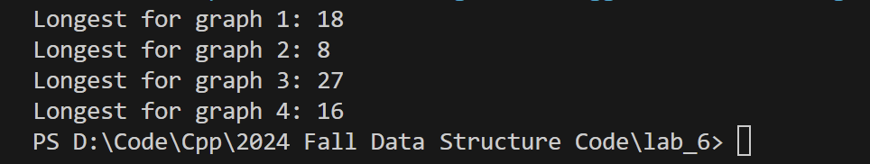

# Lab 6 23302010034 实验报告

## 实验内容

实现了一个图类，支持矩阵或者链表表示方法
实现了对应的Vertex、Edge
在此基础上，基于拓扑排序，实现了lab要求的最长路径算法

## 最长路径算法实现方式

```cpp

    void dfsHelper(VertexType* v,vector<bool>& visited,vector<int>& result){
        visited[v->getId()]=true;
        for(const pair<VertexType *, int>&target:adjList[v->getId()]){
            VertexType * neighbor=target.first;
            int weight=target.second;
            if(!visited[neighbor->getId()]){
                dfsHelper(neighbor,visited,result);
            }
        }
        result.push_back(v->getId());
    }
    std::vector<int> dfs(VertexType* start){
        if (!hasAdjList) {
            throw std::runtime_error("Adjacency list representation is required for DFS.");
        }

        std::vector<bool> visited(verticesNum+1, false); 
        std::vector<int> result;                     


        dfsHelper(start, visited, result);


        return result;
    }

    int longestPath(VertexType* start){
        if (!hasAdjList) {
            throw std::runtime_error("Adjacency list representation is required for longest path computation.");
        }

        vector<int> topOrder=dfs(start);
        std::reverse(topOrder.begin(),topOrder.end());

        vector<int> distance(verticesNum,INT_MIN);
        distance[start->getId()]=start->getWeight();

        for(int id:topOrder){
            if(distance[id]!=INT_MIN){
                for (const auto& [neighbor, weight] : adjList[id]) {
                    int vId = neighbor->getId();
                    int vertexWeight=neighbor->getWeight();
                    distance[vId] = std::max(distance[vId], distance[id] + vertexWeight);
                }
            }
        }
        int longestPath = INT_MIN;
        for (int d : distance) {
            if (d != INT_MIN) {
                longestPath = std::max(longestPath, d);
            }
        }

        return longestPath;
    }

    int longestPath(){
        vector<int> longestPaths;
        for(VertexType&vertex:vertexVec){
            int longest_path=longestPath(&vertex);
            longestPaths.push_back(longest_path);
        }
        int longestPath = INT_MIN;
        for (int d : longestPaths) {
            if (d != INT_MIN) {
                longestPath = std::max(longestPath, d);
            }
        }

        return longestPath;
    }
```

## 算法描述

首先给定了一个以链表储存的图，这个图没有环且权重在vertex上我们要获得其最长路径

### 步骤

- 1 进行拓扑排序，通过深度优先遍历并记录遍历顺序，然后reverse得到拓扑排序结果
- 2 对拓扑排序好的结果进行动态规划的遍历（第一个就是start），维护一个距离数组表示当前到对应点的最大距离，然后应用方程distance[vId] = std::max(distance[vId], distance[id] + vertexWeight)，注意到这个方程一定能得到最长路径，当遍历结束时，也就得到了start到各个点的最大距离
- 3 题目没有指定开始点，则可以默认遍历所有的节点，找到其中距离最远的那个点，最终得到长度

### 复杂度分析

对于每个起点开始，dfs时间复杂度时O(V+E),在此基础上，更新状态方程的时间复杂度时，访问了每个顶点每个邻居一次，复杂度为O(V+E)，故单个顶点复杂度为O(V+E)，为线性时间
对于所有顶点的遍历，复杂度为O(V(V+E))

### 正确性验证

以图1为例

```cpp

void test_1(){
    vector<int> weight={4,5,4,6,4,5,6,7,3,4,2,2,3,2,5};
    vector<Vertex<>> vertex=Graph<>::convertFromWeight(weight);
    vector<vector<int>> matrix=
    {{0,0,0,1,1,0,0,0,0,0,0,0,0,0,0},
    {0,0,0,0,0,1,1,0,0,0,0,0,0,0,0},
    {0,0,0,0,0,0,0,1,0,0,0,0,0,0,0},
    {0,0,0,0,0,0,0,0,0,0,0,0,1,0,0},
    {0,0,0,0,0,0,0,0,1,1,0,0,0,0,0},
    {0,0,0,0,0,0,0,0,1,1,0,0,0,0,0},
    {0,0,0,0,0,0,0,0,0,0,1,1,0,0,0},
    {0,0,0,0,0,0,0,0,0,0,1,1,0,0,0},
    {0,0,0,0,0,0,0,0,0,0,0,0,1,0,0},
    {0,0,0,0,0,0,0,0,0,0,0,0,0,1,0},
    {0,0,0,0,0,0,0,0,0,0,0,0,0,1,0},
    {0,0,0,0,0,0,0,0,0,0,0,0,0,0,1},
    {0,0,0,0,0,0,0,0,0,0,0,0,0,0,0},
    {0,0,0,0,0,0,0,0,0,0,0,0,0,0,0},
    {0,0,0,0,0,0,0,0,0,0,0,0,0,0,0}};
    

    vector<Edge<>> edges=Graph<>::convertFromMatrix(vertex,matrix);

    
    Graph<> graph=Graph<>(true,false,GraphRepresentationType::LIST_FORM,edges,vertex);
    int longest=graph.longestPath();
    cout<<"Longest for graph 1: "<<longest<<endl;
}
```

根据给定的四个示例进行验证，发现输出符合预期



说明正确实现了这个lab的要求