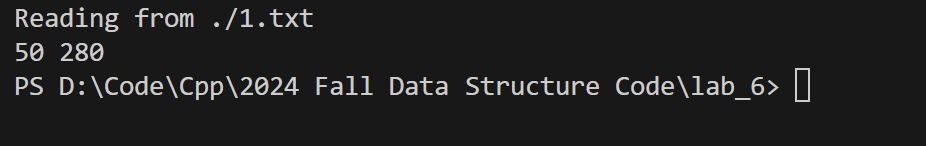

# Lab 6实验报告

## Lab问题

lab6要求解决一个最大流最小费用问题，要求找到一种费用最小的最大流

## 解决思路

(1) 为了找到最大流，我们考虑的思路是：不断找到从源到终的路径，并找到其中最小的容量加入最大流，并更新其可用流量。当不存在任何路径的时候，即找到了最大流
(2) 为了确保费用最小，我们需要在每次找到最短路径。因为每次最短路径上都会被施加相同的增广流量，因此，最短路径就代表了当前状态下、
费用最小的情况。
(3) 每次更新都找到最短路径，并计算路径上的最大流并更新每条边的可用流量。每次更新都保证了当前状态下选择了最优(费用最小)的路径。如果最后不是最优的，说明中间某一次更新可以选择费用更小的路径，这与我们局部最优的更新策略矛盾。因此，这样得到的费用就是最小的。


### 代码实现

```cpp

    FlowResult minCostMaxFlowFunc(int source, int sink) {
        double maxFlow = 0.0;
        double minCost = 0.0;

        while (true) {
            /* Step I :Shortest Path*/
            vector<double> dist(vertices.size(), std::numeric_limits<double>::infinity());
            vector<shared_ptr<Edge<EdgeCapacity>>> prevEdge(vertices.size(), nullptr);
            vector<bool> inQueue(vertices.size(), false);

            dist[source] = 0.0;
            std::queue<int> q;
            q.push(source);
            inQueue[source] = true;

            while (!q.empty()) {
                int u = q.front();
                q.pop();
                inQueue[u] = false;

                for (const auto &edge : graph.getAdjList()[u]) {
                    if (edge->getResidualCapacity() > 0) { 
                        int v = edge->getSecond()->getId();
                        double newDist = dist[u] + edge->getWeight(); 
                        if (newDist < dist[v]) {
                            dist[v] = newDist;
                            prevEdge[v] = edge;

                            if (!inQueue[v]) {
                                q.push(v);
                                inQueue[v] = true;
                            }
                        }
                    }
                }
            }

            /* Not reachable*/
            if (dist[sink] == std::numeric_limits<double>::infinity()) {
                break;
            }

            /* Step II Calculate augmentFlow ,the minium residual capacity in the path*/
            double augmentFlow = std::numeric_limits<double>::infinity();
            for (int v = sink; v != source; v = prevEdge[v]->getFirst()->getId()) {
                augmentFlow = std::min(augmentFlow, prevEdge[v]->getResidualCapacity());
            }

            // Step 3: Update maxFlow and miniCost
            for (int v = sink; v != source; v = prevEdge[v]->getFirst()->getId()) {
                auto edge = prevEdge[v];
                edge->addFlow(augmentFlow);                     
                minCost += augmentFlow * edge->getWeight();     
            }

            maxFlow += augmentFlow; 
        }

        return {maxFlow, minCost};
    }

```

该代码实现了上述思路，即分三步：先计算有剩余流量的边的最短路径，再得到和更新增加的流量。主循环表示一直找到没有任何路径可达，即得到了最后的结果。

## 时间复杂度

代码使用SPFA德辅道最短路径，复杂度为O(V*E)
设最大流量为F，平均每次增广为delta，则每次总复杂度为(F*V*E/delta)
若非负权边，可用上一次lab的dijkstra代替计算最短路径，复杂度可以降低为(F*E*logV/delta)

## 结果正确性

根据给定的测试用例（见1.txt），计算得到以下结果


与预期结果相同